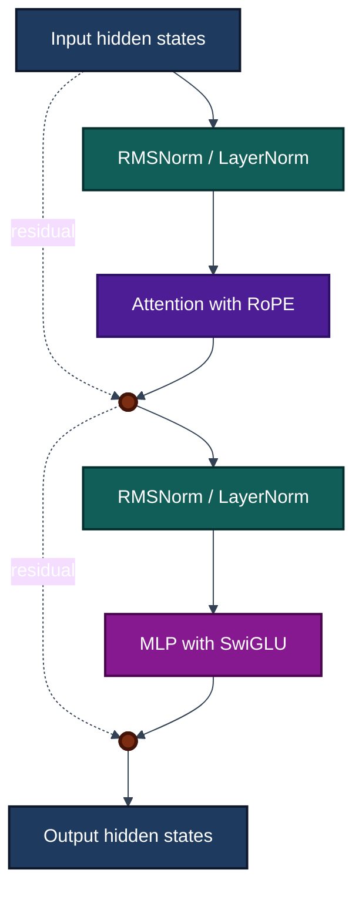

# Milestone 1

Before we can start doing any implementation we need to get acquainted with the architecture that we are going to use. In order to have an actual functioning model at the end of this milestone we are going to download the weights from [HuggingFaceTB/SmolLM2-135M](https://huggingface.co/HuggingFaceTB/SmolLM2-135M). According to the [config.json](https://huggingface.co/HuggingFaceTB/SmolLM2-135M/blob/main/config.json), the model architecture is LlamaForCausalLM we can inspect that in the [HF repo](https://github.com/huggingface/transformers/blob/main/src/transformers/models/llama/modeling_llama.py).

The Transformer block looks like the following:

From this we can start implementing the individual components

