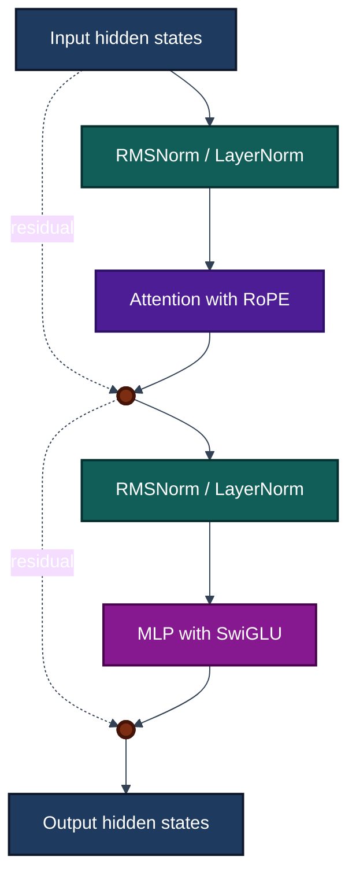

# Milestone 1

Before we can start doing any implementation we need to get acquainted with the architecture that we are going to use. In order to have an actual functioning model at the end of this milestone we are going to download the weights from [HuggingFaceTB/SmolLM2-135M](https://huggingface.co/HuggingFaceTB/SmolLM2-135M). According to the [config.json](https://huggingface.co/HuggingFaceTB/SmolLM2-135M/blob/main/config.json), the model architecture is LlamaForCausalLM, the source code can be found [here](https://github.com/huggingface/transformers/blob/main/src/transformers/models/llama/modeling_llama.py).

The Transformer block looks like the following:

Some of the components like RoPE, RMSNorm, and SwiGLU gates are non-trivial even for those with a basic understanding of LLMs so we are going explain them here. 

## [RoPE(Rotary Positional Embedding)](https://arxiv.org/pdf/1910.07467)

The Original Attention Mechanism from *Attention is All You Need* ignores the relative position of tokens almost by design, and simply adds absolute positional encoding through context. Let's assume that we are reading a piece of text, as we progress from the 5th to 6th paragraph the words that we read in the 1st paragraph should carry less and less importance. RoPE proposes an alternative Attention that strongly addresses this issue. 

Note: This is not something exclusive to RoPE, but after the *Attention is All You Need* incorporating positional encoding to the transformer blocks rather than exclusively at the bottom of the Encoder/Decoder Stack became a trend. 

