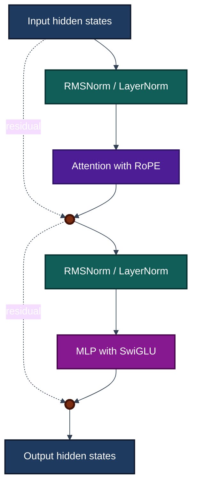

# Milestone 1

Before we can start doing any implementation we need to get acquainted with the architecture that we are going to use. In order to have an actual functioning model at the end of this milestone we are going to download the weights from [HuggingFaceTB/SmolLM2-135M](https://huggingface.co/HuggingFaceTB/SmolLM2-135M). According to the [config.json](https://huggingface.co/HuggingFaceTB/SmolLM2-135M/blob/main/config.json), the model architecture is LlamaForCausalLM, the source code can be found [here](https://github.com/huggingface/transformers/blob/main/src/transformers/models/llama/modeling_llama.py).

The Transformer block looks like the following:

Some of the components like RoPE, RMSNorm, and SwiGLU gates are non-trivial even for those with a basic understanding of LLMs so we are going explain them here. 

## [RoPE(Rotary Positional Embedding)](https://arxiv.org/pdf/1910.07467)

The Original Attention Mechanism from *Attention is All You Need* ignores the relative position of tokens almost by design, and simply adds absolute positional encoding through context. Let's assume that we are reading a piece of text, as we progress from the 5th to 6th paragraph the words that we read in the 1st paragraph should carry less and less importance. RoPE proposes an alternative Attention that strongly addresses this issue. 

Note: This is not something exclusive to RoPE, but after the *Attention is All You Need* incorporating positional encoding to the transformer blocks rather than exclusively at the bottom of the Encoder/Decoder Stack became a trend. 

RoPE is a fairly complex concept, so I recommend watching this [Video](https://www.youtube.com/watch?v=GQPOtyITy54). The underlying principle is to rotate(via rotation matrix) the embedding vectors by an angle that is proportional to their position. The intuition is the vectors with a greater angle between them have a lesser dot product. 

The way that this gets done is by grouping every two dimensions in the embeddings together and rotating them just like one would rotate a two dimensional vector. For instance, the dimensions $$j$$ and $$j+1$$ of a query embedding are rotated is the following:

$$
\begin{bmatrix}
\cos(m\theta_i) & -\sin(m\theta_i) \\
\sin(m\theta_i) & \cos(m\theta_i)
\end{bmatrix}
\begin{bmatrix}
q_j \\
q_{j+1}
\end{bmatrix}
$$

where $$m$$ is the respective position of the token in the sequence and $$i = 0,1,2,..,{{d/2}-1}$$, such that every two dimensions $$j$$ and $$j+1$$ will have their own rotation angles. The formula for theta is the following:

$$
theta_i = 10000^{-2i/d}
$$

Note that the 1st couple of dimensions, $$j=1$$, will have a much greater rotation factor that the last, $$j=d$$. The specific value of $$theta_i$$ is a hyperparameter but the authors of RoPE decided to use the same value from the sinusoidal frequencies in the *Attention is All You Need* paper. 

The most efficient way to compute this is by computing $$cos{m\theta_i}$$ and $$sin{m\theta_i}$$ once in the forward pass, and just apply it to every single attention block with the following operation:

$$
\begin{pmatrix}
x_1 \\
x_2 \\
x_3 \\
x_4 \\
\vdots \\
x_{d-1} \\
x_d
\end{pmatrix}
\otimes
\begin{pmatrix}
\cos m\theta_1 \\
\cos m\theta_1 \\
\cos m\theta_2 \\
\cos m\theta_2 \\
\vdots \\
\cos m\theta_{d/2} \\
\cos m\theta_{d/2}
\end{pmatrix}
+
\begin{pmatrix}
-x_2 \\
x_1 \\
-x_4 \\
x_3 \\
\vdots \\
-x_d \\
x_{d-1}
\end{pmatrix}
\otimes
\begin{pmatrix}
\sin m\theta_1 \\
\sin m\theta_1 \\
\sin m\theta_2 \\
\sin m\theta_2 \\
\vdots \\
\sin m\theta_{d/2} \\
\sin m\theta_{d/2}
\end{pmatrix}
$$

